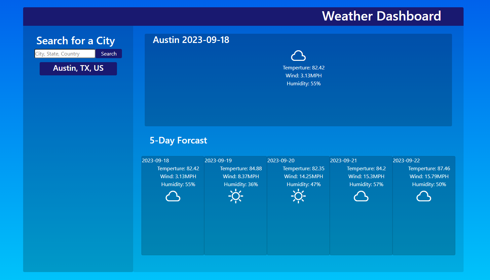

# Mod6Challenge-FiveDayForcast

# Description
## This is a weather app. By entering a city name, state code, and the country code you can get the current weather and weather for the next 5 days.
## Once you've searched for a city it's entered into the localStorage and a button is created so you can access it again easily. This feature is great for compairing weather in multiple locations.

# Screenshots

# External Sources
* [Blue Gradiant](https://gradients.shecodes.io/gradients/801#gradient)
* [5 Day Weather OpenWeather API](https://openweathermap.org/forecast5)
* [JavaScript.PlainEnglish](https://javascript.plainenglish.io/display-7-day-weather-forecast-with-openweather-api-aac8ba21c9e3)
* [BitHacker - Fetch the Weather](https://bithacker.dev/fetch-weather-openweathermap-api-javascript)
